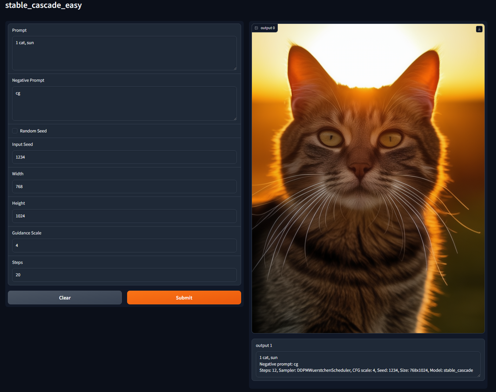

# stable_cascade_easy
Text to Img with Stable Cascade(on gradio interface), required less vram than original example on official Hugginface(https://huggingface.co/stabilityai/stable-cascade):
- 44 seconds for a 1280x1536 image with a nvidia RTX3060 with 12 GB VRAM


# Installation:
1. Install [Python 3.10.6](https://www.python.org/downloads/release/python-3106/), checking "Add Python to PATH".
2. Install [git](https://git-scm.com/download/win).
3. On terminal:
```bash
git clone https://github.com/shiroppo/stable_cascade_easy
cd stable_cascade_easy
py -m venv venv
.\venv\Scripts\activate
pip install -r requirements.txt
```
4. and then:
```bash
pip install git+https://github.com/kashif/diffusers.git@wuerstchen-v3
```
# Run:
### Method 1
- Double click on ```app.bat``` on stable_cascade_easy directory
### Method 2
- On terminal:
```bash
.\venv\Scripts\activate
py app.py
```
# Update:
1. ```git pull```(if error: ```git stash``` and after ```git pull```)
2. ```.\venv\Scripts\activate```
3. ```pip install -r requirements.txt```
   
# Code(without gradio):
```bash
import torch
from diffusers import StableCascadeDecoderPipeline, StableCascadePriorPipeline
import gc

device = "cuda"
num_images_per_prompt = 1

prior = StableCascadePriorPipeline.from_pretrained("stabilityai/stable-cascade-prior", torch_dtype=torch.bfloat16).to(device)
prior.safety_checker = None
prior.requires_safety_checker = False

prompt = "a cat"
negative_prompt = ""

prior_output = prior(
    prompt=prompt,
    width=1280,
    height=1536,
    negative_prompt=negative_prompt,
    guidance_scale=4.0,
    num_images_per_prompt=num_images_per_prompt,
    num_inference_steps=20
)

del prior
gc.collect()
torch.cuda.empty_cache()

decoder = StableCascadeDecoderPipeline.from_pretrained("stabilityai/stable-cascade",  torch_dtype=torch.float16).to(device)
decoder.safety_checker = None
decoder.requires_safety_checker = False

decoder_output = decoder(
    image_embeddings=prior_output.image_embeddings.half(),
    prompt=prompt,
    negative_prompt=negative_prompt,
    guidance_scale=0.0,
    output_type="pil",
    num_inference_steps=12
).images[0].save("image.png")

# del decoder
# gc.collect()
# torch.cuda.empty_cache()
```
# Support:
- ko-fi: (https://ko-fi.com/shiroppo)
